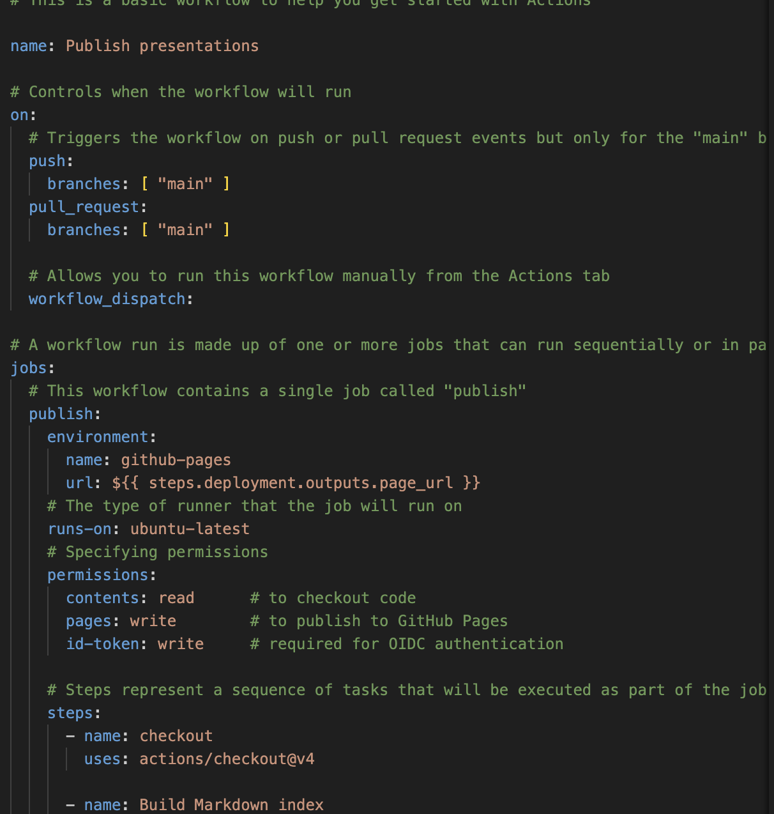
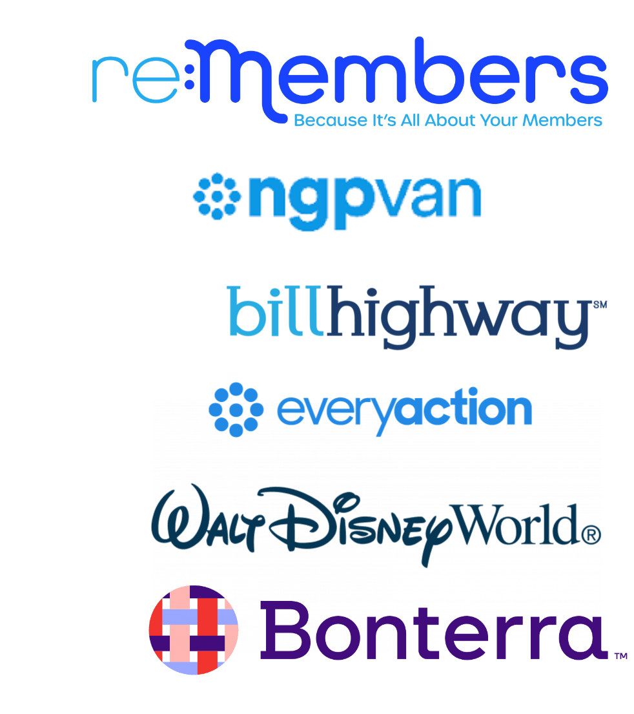
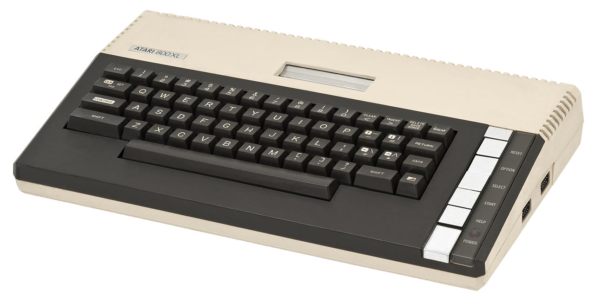
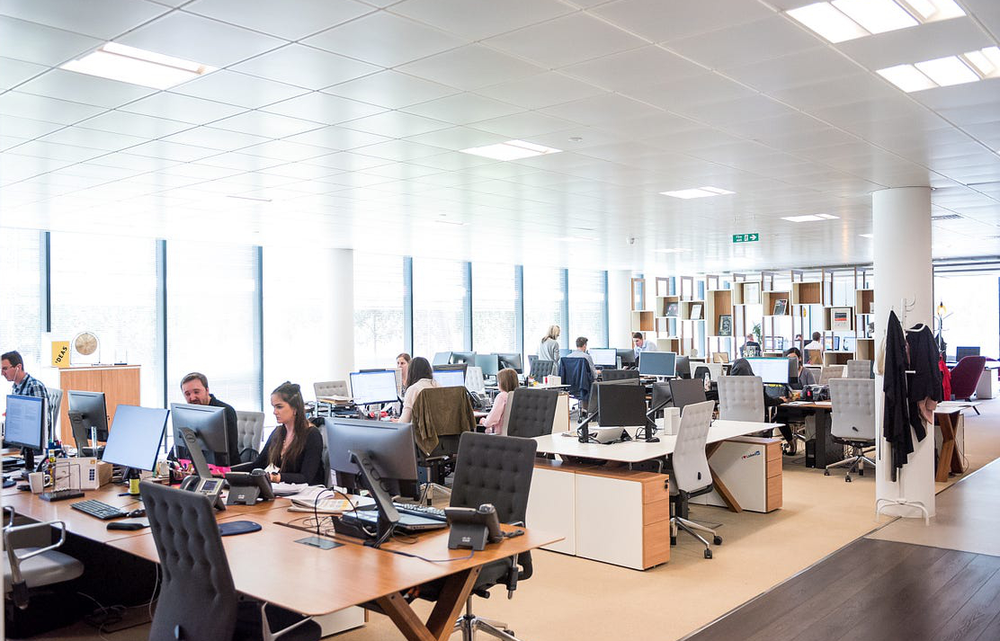

# Career Path & Work Experience of a Software Engineer
## Mike Holczer
Application Architect

---

## Work Experience

- 25 years experince in software engineering
- Mostly using Web Apps with .NET
- Short Summer Internships
- Worked at
  - The Walt Disney World Resort
  - NGP Software / NGP VAN / EveryAction / Bonterra
  - Billhighway / re:Members

---

## How I got started

- We got an Atari 800XL when I was about 6.
- Mostly a game console, but if you didn't put a cartridge in you got a BASIC interpreter.
- I copied BASIC code out of the manual (also how I learned to type)

<!-- _footer: "Image By Evan-Amos - Own work, CC BY-SA 3.0, https://commons.wikimedia.org/w/index.php?curid=18553927" -->

---

## Computer Science Education

- Newton North High School
- University of Michigan
  - 1 semester
- Brandeis University, Waltham, MA
  - B.A. Computer Science

---

# Work Experience

- Disney
  - Built document management systems
  - Supported Software Distribution
  - Anti-malware
- NGP VAN
  - Built a fundrasing, complicance and organizing CRM for Democratic campaigns, partys and progressive non-profits
- re:Members
  - Building Accounting, Member Managements and General Association Management for fraternities, sororities, unions and trade associations

---

## What to Expect in Software Engineering

---

## Entry Level Role Experience

- Work on a team
- Generally get specific small tasks
- It's great if you can work and solve problems independently
- But you're expected to need help
- Don't spend more than ~30 minutes being stuck
- Search and AI are your friend, it's very unlikely you will need to solve a problem that hasn't been solved before.
- Don't be afraid to ask questions, but try to not ask the same one twice
- You will make mistakes, but try to not make the same one twice

---

## As You Gain Experience

- People will start asking you for help
- You'll still need to ask others for help too
- It's likely you will be part of a on-call rotation
- Improve how you solve problems when you see them again
- You will be frustrated by your previous choices
- Take the lead on larger features and projects
- Figure out what direction you want your career to take

---

## Promotion Ladders

||Technical|Management|
|-|-|-|
|Types of Decisions|Technical and Architectual|Prioritization and Resource Allocation|
|Leadership|Provide technical leadership and expertise on application(s)|Manage team(s) of developers|
|Daily Tasks|Writing code, reviewing code, helping other engineers|Planning Meetings, Business Meetings, Managing People|
|Titles| Senior/Principal/Partner Engineer/Architect|Team Lead, Engineering Manager, Director of Engineering, VP of Engineering, CTO|

---

## Day in the Life

- Collaborate with Product on problems we need to solve
- Figure out how to solve them efficiently
- Implement the solutions
- Figure out how new technologies work
- Make and correct mistakes

## Current Project

- AI Chat Agent and MCP Server
  - Allows users to interact with their data through natural language
  - Users can use it with the LLM of their choice to help them analyze, interact and visualize there data

---

## Advice

- Getting a foundation in Computer Science concepts is very helpful
- There is no substitute for actually building things
  - Build projects
  - Make mistakes and *learn how to fix them*
- Stay curious, but also pragmatic
  - Boring code is good
  - Don't over architect
  - Understand user needs
- If an interviewer is good, they are hoping you will do well

---

## Q&A

---

# Thank You!
|That Sinking Feeling (#HugOps Song)|You Belong|
|---|-----|
|  | |